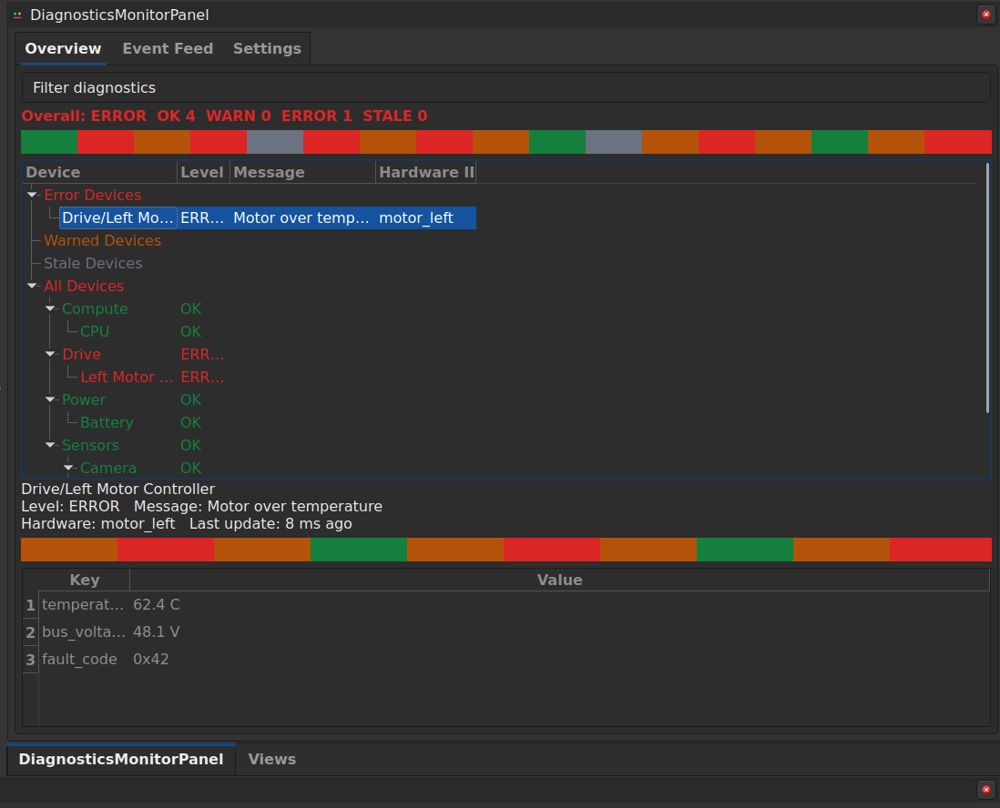
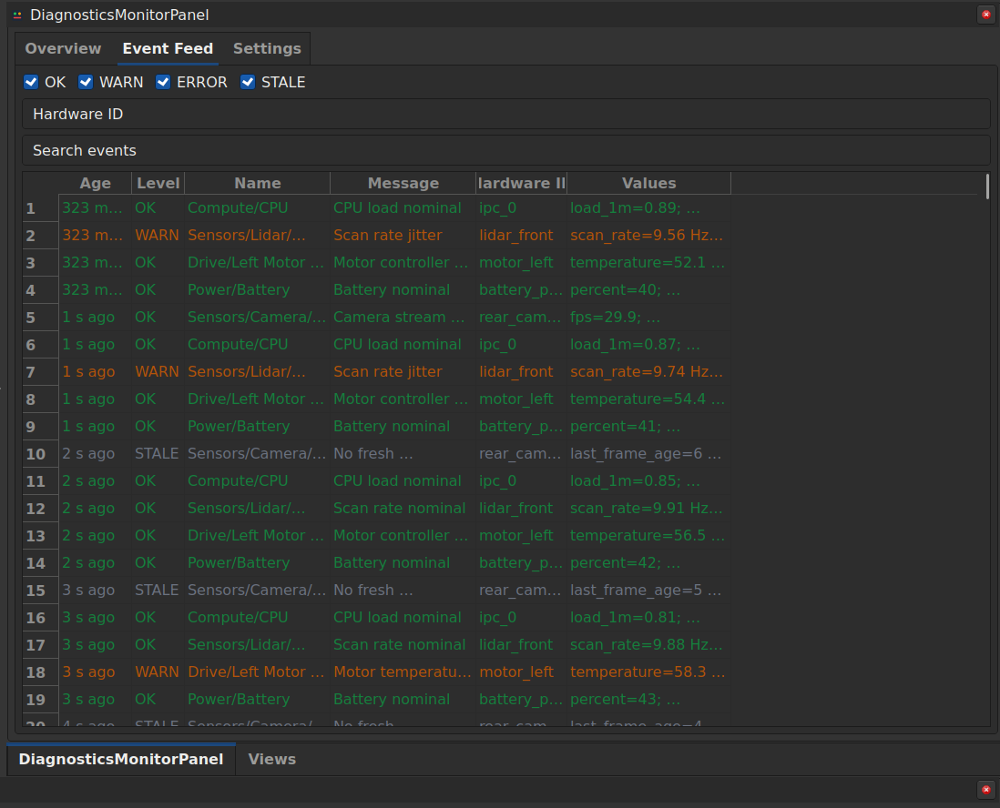

# rviz2_diagnostics_monitor

Standalone RViz 2 panel for monitoring `diagnostic_msgs/msg/DiagnosticArray`
streams. The panel defaults to `/diagnostics`, groups diagnostic names into
an operator tree, keeps bounded health history, and records event-feed rows only
when a diagnostic state changes.

## Overview

The Overview tab groups diagnostics by their `/`-separated names, summarizes the
current robot health, and splits all/error/warn/stale views into compact
hierarchical trees. Double-click a diagnostic leaf to open its detail popup.

## Event Feed

The Event Feed tab records diagnostic state changes only. It shows a compact
name/message table, can be filtered by severity, hardware ID, and free-text
search, and opens the full diagnostic popup on row double-click.

